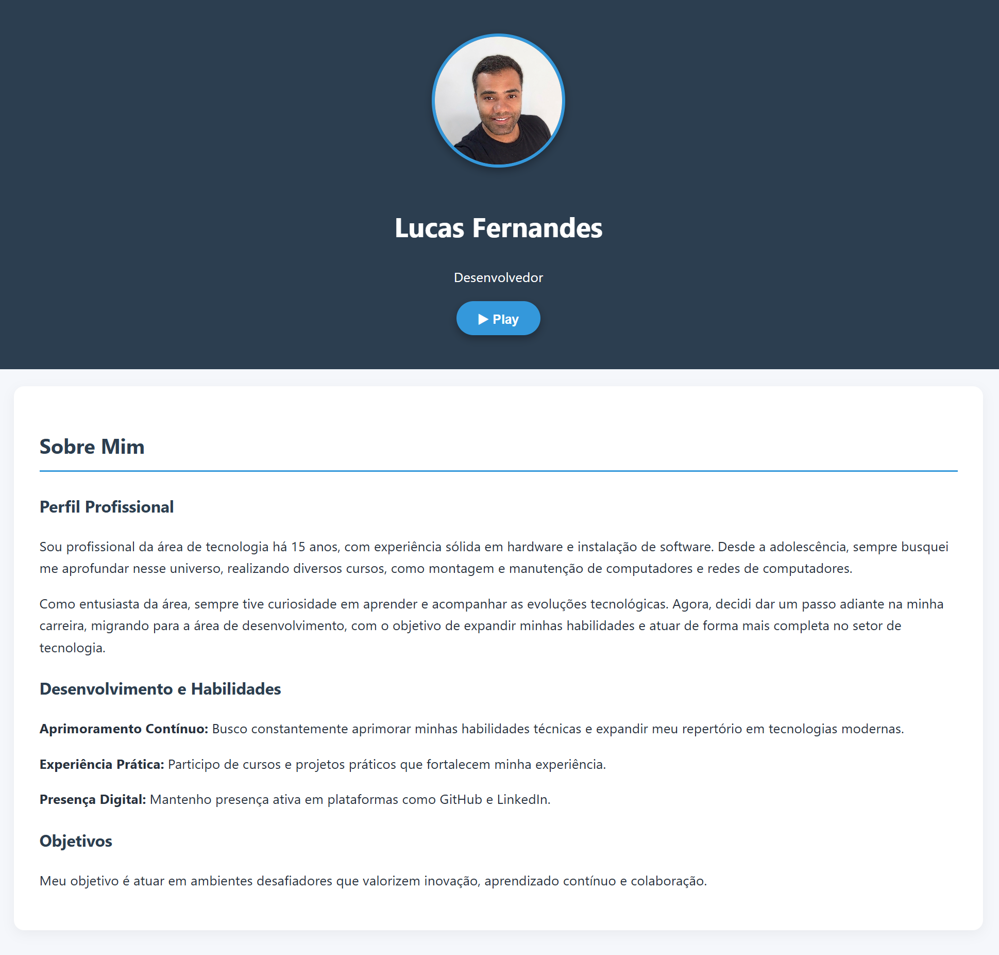

# Portfólio | Lucas Fernandes

Portfólio pessoal desenvolvido em HTML, CSS e JavaScript, com foco em apresentar minha trajetória profissional, certificações e projetos na área de tecnologia.

## Prévia



## Sobre

Sou profissional da área de tecnologia há 15 anos, com experiência em hardware, instalação de software, manutenção de computadores e redes. Atualmente estou expandindo minha atuação para desenvolvimento de software, unindo minha base técnica em infraestrutura com práticas modernas de programação.

## Projeto em Destaque

### Sistema LJV

O Sistema LJV é um ecossistema ERP/PDV All-in-One voltado para pequenas e médias empresas, integrando módulos de vendas, estoque, financeiro, relatórios analíticos e controle de acessos.

Principais pontos técnicos:

- Arquitetura Serverless com Cloudflare Workers.
- Banco de dados Cloudflare D1 com SQLite distribuído na Edge.
- Backend e Frontend com TypeScript.
- Roteamento com Hono Framework.
- Validação de dados com Zod.
- Segurança com PBKDF2, tokens em hash SHA-256, Rate Limiting e RBAC dinâmico.
- Galeria de telas com visualização ampliada em modal.

## Tecnologias Utilizadas

- HTML5
- CSS3
- JavaScript
- Organização de assets por tipo
- Estrutura estática pronta para GitHub Pages

## Estrutura do Projeto

```text
.
├── index.html
├── assets/
│   ├── audio/
│   ├── certificates/
│   ├── css/
│   ├── icons/
│   ├── images/
│   │   └── sistema-ljv/
│   └── js/
├── .gitignore
└── README.md
```

## Como Visualizar

Abra o arquivo `index.html` diretamente no navegador.

Também é possível usar uma extensão como Live Server no VS Code para visualizar o projeto em ambiente local.

## Boas Práticas Aplicadas

- Separação de HTML, CSS e JavaScript.
- Arquivos de mídia organizados por tipo.
- Nomes de arquivos padronizados para uso na web.
- Galeria responsiva com modal e fechamento por tecla `Esc`.
- Links externos com `rel="noopener noreferrer"`.
- Estrutura simples e pronta para deploy estático.

## Contato

- GitHub: [Lcsf-dev](https://github.com/Lcsf-dev)
- LinkedIn: [lucasfernandes-dev](https://www.linkedin.com/in/lucasfernandes-dev/)
- E-mail: [lucaslcsf.dev@gmail.com](mailto:lucaslcsf.dev@gmail.com)
